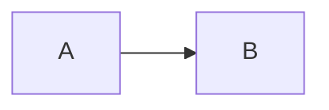

# caseonix

> A solo AI lab building tools for Canadian regulated markets — residency, privilege, audit trails, agentic reliability. Waterloo, ON · Est. 2024.

**Live:** [caseonix.ca](https://caseonix.ca)

This repo is the source of the site itself — the homepage, blog, lab notes, and the Cloudflare Worker that powers the hero's Live Status widget. The site is where I think out loud; the `/blog/` and `/notes/` directories are the public trail.

---

## What's in here

```
/                       Static homepage (index.html) — deployed by GitHub Pages
/blog/                  Long-form posts (HTML with JSON-LD)
/notes/                 Shorter lab + research notes
/worker/                Cloudflare Worker — /api/status + GitHub webhook sink
/scripts/               Build scripts (log index generator)
/.github/workflows/     Automations (auto-rebuild log index on publish)
```

## Architecture

- **Site:** plain HTML/CSS, zero build step, served by GitHub Pages from `main`.
- **Worker:** [`worker/`](./worker) — Cloudflare Worker bound to `caseonix.ca/api/*` and `caseonix.ca/webhooks/*`. Receives GitHub webhook events from the sub-project repos, maintains a compact status snapshot in Workers KV, serves it to the homepage widget. Details in [`worker/README.md`](./worker/README.md).
- **Single origin:** everything is `caseonix.ca` — Pages for static, Worker for `/api/*`. No CORS, no subdomain.

## Major builds

Each project below has its own repo. They're all tools I use myself or built for real Canadian compliance problems.

| Project | What it is | Repo |
|---|---|---|
| **LocalMind Sovereign** | Sovereign document intelligence — classification, PII redaction, compliance checklists on Cloudflare's Canadian edge | [localmind](https://github.com/caseonix/localmind) |
| **Consul** | AI-assisted portfolio analysis with deterministic math (Sharpe, VaR) + AI narratives | [consul.caseonix.ca](https://consul.caseonix.ca) |
| **FinLit** | Python library for extracting structured data from Canadian financial documents (T-slips, SEDAR, bank statements) with PIPEDA PII detection | [FinLit](https://github.com/caseonix/FinLit) |
| **wealth-guide** | Claude Code skill that dispatches six specialist agents to produce a 12-section financial plan | [wealth-guide](https://github.com/caseonix/wealth-guide) |
| **Canadian Tax & CRA** | Claude Code plugin — eight slash commands for CRA compliance across 13 jurisdictions | [canadian-tax-cra](https://github.com/caseonix/canadian-tax-cra) |
| **Canadian Regulatory** | Claude Code plugin covering 11 domains: PIPEDA, CASL, FINTRAC, OSFI, FCAC, and more | [canadian-regulatory-compliance](https://github.com/caseonix/canadian-regulatory-compliance) |
| **LoonieLog** | Receipt tracking for Canadian freelancers — auto-scans Gmail/Drive, T2125-mapped | [LoonieLog](https://github.com/caseonix/LoonieLog) |

## Stack

What actually powers this site and the broader work:

- **Languages:** Python, TypeScript, SQL
- **Models:** Claude (Opus, Sonnet), Gemini (extraction), MCP protocol, pydantic-ai
- **Infra:** Cloudflare Workers, D1, R2, Vectorize, Workers AI
- **Framework:** Hono (Workers), plain HTML for this site

## Publishing a post

### Lab notes (`/notes/`)

Write in markdown. Drop a new `.md` file into `/notes/` with YAML frontmatter:

```yaml
---
title: "Lab note — how I broke RAG"
date: 2026-04-23
slug: how-i-broke-rag
description: "A one-paragraph summary used in meta description and og:description."
tags: [rag, cloudflare]     # optional
series: null                 # optional, for multi-part series
---
```

Required fields: `title`, `date` (YYYY-MM-DD), `slug` (must match filename), `description`. Optional: `type` (defaults to `note`), `series`, `tags`.

The body is plain markdown. Mermaid diagrams work:

````

````

Commit and push. A GitHub Action (`.github/workflows/build-notes.yml`) runs `scripts/build-notes.mjs` (generates the HTML) and `scripts/build-og-images.mjs` (generates a 1200×630 social share card at `/og/<slug>.png`), then commits both back to `main`. A second Action (`build-log-index.yml`) updates `log.json` and the homepage § RECENT FROM THE LOG rows. End-to-end latency: ~60-90s from `git push` to live.

To run the build locally: `npm run build:notes` for HTML only, `npm run build:og` for just OG images, or `npm run build` to do everything (HTML + OG images + log index).

### Blog posts (`/blog/`)

Blog posts are still hand-authored HTML with JSON-LD. Drop the file, commit, push — `build-log-index.yml` picks it up for the homepage feed.

New posts need the drawing-set theme block right before `</head>` (copy it from any existing post):

```html
<!-- drawing-set theme -->
<link href="https://fonts.googleapis.com/css2?family=Archivo:wdth,wght@62..125,300..800&family=Martian+Mono:wdth,wght@75..112.5,300..600&display=swap" rel="stylesheet" />
<link rel="stylesheet" href="/assets/drawing-set.css" />
<link rel="stylesheet" href="/assets/drawing-set-pages.css" />
<!-- /drawing-set theme -->
```

## Design

The site uses the "drawing set" theme: cyanotype dark by default, whiteprint in light mode. The shared styles live in `assets/drawing-set.css`, which covers the tokens, nav, theme toggle and title-block footer. Blog and notes components live in `assets/drawing-set-pages.css`. Homepage components are inline in `index.html`.

The previous teal-on-navy design is kept in git as the tag `teal-design-final` and the branch `backup/teal-design-2026-09`. To switch back:

```sh
git checkout teal-design-final -- index.html blog notes scripts/templates/note.html
```

## Why public

Threads land with me directly — no agency layer, no SDR queue. Keeping the site repo public is part of that. If you want to see how something on the homepage is built, it's here.

## Contact

- **Email:** srivatsa.kasagar@gmail.com
- **LinkedIn:** [linkedin.com/in/skasagar](https://linkedin.com/in/skasagar)
- **GitHub:** [github.com/caseonix](https://github.com/caseonix)
