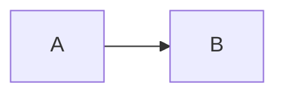

# Publishing and site internals

Working notes for the site itself. The public README stays about the lab and its builds; the mechanics live here.

## What's in the repo

```
/                       Static homepage (index.html), served by GitHub Pages from main
/blog/                  Long-form posts (HTML with JSON-LD)
/notes/                 Shorter lab and research notes (markdown, built to HTML)
/worker/                Cloudflare Worker: /api/status and the GitHub webhook sink
/scripts/               Build scripts (notes, OG images, log index)
/.github/workflows/     Automations that rebuild notes and the log index on push
```

## Architecture

- **Site:** plain HTML/CSS, zero build step, served by GitHub Pages from `main`.
- **Worker:** [`worker/`](../worker) is a Cloudflare Worker bound to `caseonix.ca/api/*` and `caseonix.ca/webhooks/*`. It receives GitHub webhook events from the project repos, keeps a compact status snapshot in Workers KV and serves it to the homepage's Revision block. Details in [`worker/README.md`](../worker/README.md); adding a repo is in [`ADDING_REPOS.md`](../ADDING_REPOS.md).
- **Single origin:** everything is `caseonix.ca`. Pages for static, Worker for `/api/*`. No CORS, no subdomain.

## Stack

- **Languages:** Python, TypeScript, Swift, SQL
- **Models:** Claude (Opus, Sonnet), Gemini (extraction), MCP protocol, pydantic-ai
- **Infra:** Cloudflare Workers, D1, R2, Vectorize, Workers AI
- **Framework:** Hono (Workers), plain HTML for this site

## Publishing a post

### Lab notes (`/notes/`)

Write in markdown. Drop a new `.md` file into `/notes/` with YAML frontmatter:

```yaml
---
title: "Lab note — how I broke RAG"
date: 2026-04-23
slug: how-i-broke-rag
description: "A one-paragraph summary used in meta description and og:description."
tags: [rag, cloudflare]     # optional
series: null                 # optional, for multi-part series
---
```

Required fields: `title`, `date` (YYYY-MM-DD), `slug` (must match filename), `description`. Optional: `type` (defaults to `note`), `series`, `tags`.

The body is plain markdown. Mermaid diagrams work:

````

````

Commit and push. A GitHub Action (`.github/workflows/build-notes.yml`) runs `scripts/build-notes.mjs` (generates the HTML) and `scripts/build-og-images.mjs` (generates a 1200×630 social share card at `/og/<slug>.png`), then commits both back to `main`. A second Action (`build-log-index.yml`) updates `log.json` and the homepage's recent-from-the-log rows. End-to-end latency is about 60 to 90 seconds from `git push` to live.

To run the build locally: `npm run build:notes` for HTML only, `npm run build:og` for just OG images, or `npm run build` to do everything (HTML, OG images and log index).

### Blog posts (`/blog/`)

Blog posts are hand-authored HTML with JSON-LD. Drop the file, commit, push; `build-log-index.yml` picks it up for the homepage feed.

New posts need the drawing-set theme block right before `</head>` (copy it from any existing post):

```html
<!-- drawing-set theme -->
<link href="https://fonts.googleapis.com/css2?family=Archivo:wdth,wght@62..125,300..800&family=Martian+Mono:wdth,wght@75..112.5,300..600&display=swap" rel="stylesheet" />
<link rel="stylesheet" href="/assets/drawing-set.css" />
<link rel="stylesheet" href="/assets/drawing-set-pages.css" />
<!-- /drawing-set theme -->
```

### Homepage sheets

Products are "sheets" in `index.html` under `#sheets`. Featured builds are `<article class="sheet …">` cards numbered A-101 onward; tools and libraries are rows in the A-200 index table. When adding a card, give it a `.sheet.<slug>` grid-column rule in the CSS and update the "N sheets" copy in the section head.

## Design

The site uses the "drawing set" theme: cyanotype dark by default, whiteprint in light mode. The shared styles live in `assets/drawing-set.css`, which covers the tokens, nav, theme toggle and title-block footer. Blog and notes components live in `assets/drawing-set-pages.css`. Homepage components are inline in `index.html`.

The previous teal-on-navy design is kept in git as the tag `teal-design-final` and the branch `backup/teal-design-2026-09`. To switch back:

```sh
git checkout teal-design-final -- index.html blog notes scripts/templates/note.html
```

## Deploying

- **Homepage, blog, notes:** push to `main`. GitHub Pages builds within a minute or two. If a build does not start, request one with `gh api -X POST repos/caseonix/Caseonix/pages/builds`.
- **Worker:** `cd worker && make typecheck && make deploy`.
